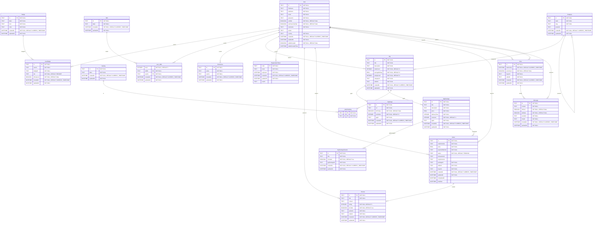

```mermaid
erDiagram
  %% Badge table
  Badge {
    TEXT id PK "NOT NULL"
    TEXT label "NOT NULL"
    TEXT icon "NOT NULL"
    TEXT color "NOT NULL"
    DATETIME createdAt "NOT NULL, DEFAULT CURRENT_TIMESTAMP"
    DATETIME updatedAt "NOT NULL"
  }

  %% UserBadge table
  UserBadge {
    TEXT id PK "NOT NULL"
    TEXT userId "NOT NULL"
    TEXT badgeId "NOT NULL"
    TEXT tier "NOT NULL, DEFAULT 'BRONZE'"
    BOOLEAN isFeatured "NOT NULL, DEFAULT false"
    DATETIME createdAt "NOT NULL, DEFAULT CURRENT_TIMESTAMP"
    DATETIME updatedAt "NOT NULL"
  }

  %% User table
  User {
    TEXT id PK "NOT NULL"
    TEXT firstName "NOT NULL"
    TEXT lastName "NOT NULL"
    TEXT email "NOT NULL"
    TEXT password "NOT NULL"
    BOOLEAN verified "NOT NULL, DEFAULT false"
    BOOLEAN twoFactorVerified "NOT NULL, DEFAULT false"
    TEXT username "NOT NULL"
    TEXT avatar
    TEXT country "NOT NULL"
    DATETIME createdAt "NOT NULL, DEFAULT CURRENT_TIMESTAMP"
    DATETIME updatedAt "NOT NULL"
    BOOLEAN walletCreated "NOT NULL, DEFAULT false"
    DATETIME walletCreatedTime
  }

  %% Skill table
  Skill {
    TEXT id PK "NOT NULL"
    TEXT label "NOT NULL"
    DATETIME createdAt "NOT NULL, DEFAULT CURRENT_TIMESTAMP"
    DATETIME updatedAt "NOT NULL"
  }

  %% GigTag table
  GigTag {
    TEXT id PK "NOT NULL"
    TEXT label "NOT NULL"
    DATETIME createdAt "NOT NULL, DEFAULT CURRENT_TIMESTAMP"
    DATETIME updatedAt "NOT NULL"
  }

  %% user_skills join table
  user_skills {
    INTEGER level "NOT NULL, DEFAULT 1"
    TEXT skillId PK "NOT NULL"
    TEXT userId PK "NOT NULL"
    DATETIME createdAt "NOT NULL, DEFAULT CURRENT_TIMESTAMP"
    DATETIME updatedAt "NOT NULL"
  }

  %% Biometrics table
  Biometrics {
    TEXT id PK "NOT NULL"
    TEXT value "NOT NULL"
    TEXT userId "NOT NULL"
    DATETIME createdAt "NOT NULL, DEFAULT CURRENT_TIMESTAMP"
    DATETIME updatedAt "NOT NULL"
  }

  %% Gig table
  Gig {
    TEXT id PK "NOT NULL"
    TEXT title "NOT NULL"
    TEXT description "NOT NULL"
    INTEGER viewCount "NOT NULL, DEFAULT 0"
    REAL averageRating "NOT NULL, DEFAULT 0"
    INTEGER ratingCount "NOT NULL, DEFAULT 0"
    TEXT categoryId "NOT NULL"
    TEXT sellerId "NOT NULL"
    DATETIME createdAt "NOT NULL, DEFAULT CURRENT_TIMESTAMP"
    DATETIME updatedAt "NOT NULL"
  }

  %% RegistrationToken table
  RegistrationToken {
    TEXT code PK "NOT NULL"
    TEXT email "NOT NULL"
    DATETIME expiresAt "NOT NULL"
    DATETIME createdAt "NOT NULL, DEFAULT CURRENT_TIMESTAMP"
    DATETIME updatedAt "NOT NULL"
    TEXT userId
  }

  %% GigImage table
  GigImage {
    TEXT id PK "NOT NULL"
    TEXT url "NOT NULL"
    BOOLEAN isPrimary "NOT NULL, DEFAULT false"
    INTEGER sortOrder "NOT NULL, DEFAULT 0"
    TEXT gigId "NOT NULL"
    DATETIME createdAt "NOT NULL, DEFAULT CURRENT_TIMESTAMP"
    DATETIME updatedAt "NOT NULL"
  }

  %% GigPackage table
  GigPackage {
    TEXT id PK "NOT NULL"
    TEXT title "NOT NULL"
    TEXT description "NOT NULL"
    REAL price "NOT NULL"
    INTEGER deliveryTime "NOT NULL"
    INTEGER revisions "NOT NULL, DEFAULT 1"
    TEXT gigId "NOT NULL"
    DATETIME createdAt "NOT NULL, DEFAULT CURRENT_TIMESTAMP"
    DATETIME updatedAt "NOT NULL"
  }

  %% GigPackageFeature table
  GigPackageFeature {
    TEXT id PK "NOT NULL"
    TEXT title "NOT NULL"
    BOOLEAN included "NOT NULL, DEFAULT true"
    TEXT gigPackageId "NOT NULL"
    DATETIME createdAt "NOT NULL, DEFAULT CURRENT_TIMESTAMP"
    DATETIME updatedAt "NOT NULL"
  }

  %% Review table
  Review {
    TEXT id PK "NOT NULL"
    TEXT title "NOT NULL"
    TEXT content
    INTEGER rating "NOT NULL, DEFAULT 5"
    BOOLEAN isPublic "NOT NULL, DEFAULT true"
    TEXT authorId "NOT NULL"
    TEXT orderId "NOT NULL"
    DATETIME createdAt "NOT NULL, DEFAULT CURRENT_TIMESTAMP"
    DATETIME updatedAt "NOT NULL"
  }

  %% Category table
  Category {
    TEXT id PK "NOT NULL"
    TEXT label "NOT NULL"
    TEXT slug "NOT NULL"
    TEXT parentId
    DATETIME createdAt "NOT NULL, DEFAULT CURRENT_TIMESTAMP"
    DATETIME updatedAt "NOT NULL"
  }

  %% Order table
  Order {
    TEXT id PK "NOT NULL"
    TEXT orderNumber "NOT NULL"
    REAL price "NOT NULL"
    TEXT paymentMethod "NOT NULL"
    TEXT status "NOT NULL, DEFAULT 'PENDING'"
    TEXT transactionId
    TEXT requirements
    TEXT packageId "NOT NULL"
    TEXT sellerId "NOT NULL"
    TEXT buyerId "NOT NULL"
    DATETIME createdAt "NOT NULL, DEFAULT CURRENT_TIMESTAMP"
    DATETIME updatedAt "NOT NULL"
    DATETIME completedAt
    DATETIME dueDate
  }

  %% Chat table
  Chat {
    TEXT id PK "NOT NULL"
    DATETIME lastActivity "NOT NULL, DEFAULT CURRENT_TIMESTAMP"
    BOOLEAN isArchived "NOT NULL, DEFAULT false"
    TEXT buyerId "NOT NULL"
    TEXT sellerId "NOT NULL"
    DATETIME createdAt "NOT NULL, DEFAULT CURRENT_TIMESTAMP"
    DATETIME updatedAt "NOT NULL"
  }

  %% Message table
  Message {
    TEXT id PK "NOT NULL"
    TEXT content "NOT NULL"
    BOOLEAN isRead "NOT NULL, DEFAULT false"
    BOOLEAN isEdited "NOT NULL, DEFAULT false"
    TEXT senderId "NOT NULL"
    TEXT chatId "NOT NULL"
    DATETIME createdAt "NOT NULL, DEFAULT CURRENT_TIMESTAMP"
    DATETIME updatedAt "NOT NULL"
  }

  %% Junction table for Gig and GigTag
  _GigToGigTag {
    TEXT A PK "NOT NULL"
    TEXT B PK "NOT NULL"
  }

  %% Relationships
  User ||--o{ UserBadge : userId
  Badge ||--o{ UserBadge : badgeId

  User ||--o{ user_skills : userId
  Skill ||--o{ user_skills : skillId

  User ||--o{ Biometrics : userId

  User ||--o{ Gig : sellerId
  Category ||--o{ Gig : categoryId

  User ||--o{ RegistrationToken : userId

  Gig ||--o{ GigImage : gigId

  Gig ||--o{ GigPackage : gigId
  GigPackage ||--o{ GigPackageFeature : gigPackageId

  User ||--o{ Review : authorId
  Order ||--o{ Review : orderId

  Category ||--o{ Category : parentId

  GigPackage ||--o{ Order : packageId
  User ||--o{ Order : sellerId
  User ||--o{ Order : buyerId

  User ||--o{ Chat : buyerId
  User ||--o{ Chat : sellerId

  Chat ||--o{ Message : chatId
  User ||--o{ Message : senderId

  Gig ||--o{ _GigToGigTag : A
  GigTag ||--o{ _GigToGigTag : B
```